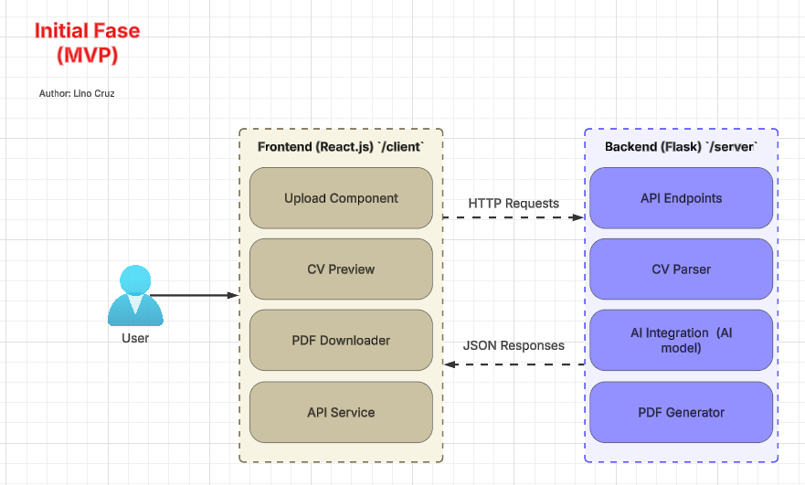

# CV Fitter

Author: Lino Cruz

A web application to help users improve their CVs based on specific job descriptions. Users upload their CV and job requirements, and the system uses AI (e.g., GPT) to generate an improved version, which can be downloaded as a PDF.

---

## Table of Contents

1. [Overview](#overview)
2. [Architecture](#architecture)

---

## Overview

**CV Fitter** allows users to:
- Upload an existing CV (e.g., PDF or DOCX).
- Input or upload a job description.
- Receive an AI-enhanced CV tailored to the job requirements.
- Download the improved CV in PDF format.

This MVP uses a monolithic-style approach in a single repository, but with a clear separation of concerns:
- **Frontend (React) in the `/client` folder**  
- **Backend (Flask) in the `/server` folder**  

---

## Architecture

Below is the **MVP architecture** for the project. The frontend sends HTTP requests to the backend for tasks such as file uploads, AI processing, and PDF generation, and the backend responds with JSON or serves the final PDF file.

### Diagram

You can view the architecture in Lucidchart here:  
[**Architecture Diagram**](https://lucid.app/lucidchart/9904d87b-0f02-4861-ac86-49fabac0bb71/view)

